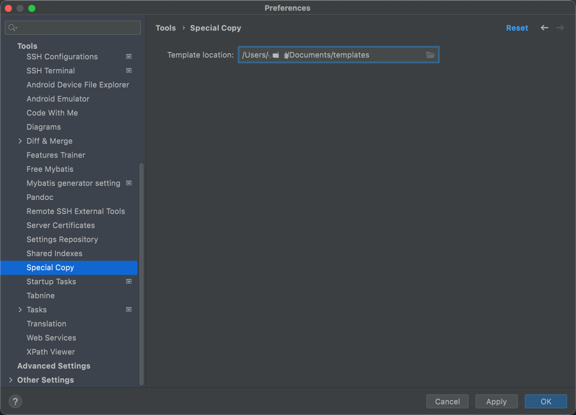
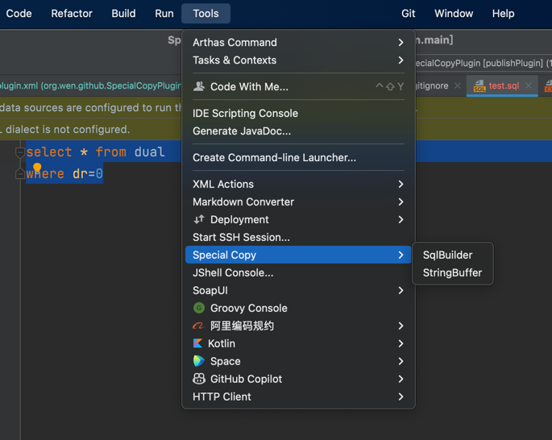
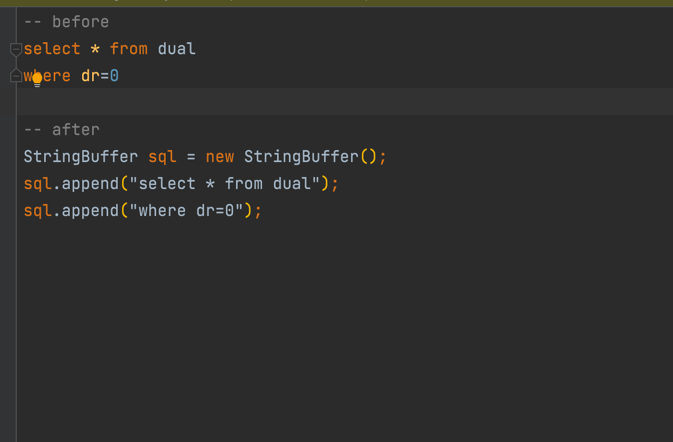

# SpecialCopyPlugin

## Usage
Download and install the plugin manually from the IntelliJ Plugin Website or use the Plugin Repository Browser in your IDE.  
After install the plugin you can touch a *.copy file template in any folder.  
The copy file like this :
~~~
;SpecialCopy definition 
;&lt;LINE_1&gt; for first line 
;&lt;LINE_*&gt; for all other lines 
;&lt;LINE_N&gt; for last line 

StringBuffer sql = new StringBuffer(); 
sql.append("&lt;line_1&gt;"); 
sql.append("&lt;line_*&gt;"); 
sql.append("&lt;line_n&gt;"); 
~~~
Then you can open the idea settings to set the template file location.  

After all settings is done and select some words, you can see the menu items in Tools|Special Copy, like this:  

When you click the StringBuffer action the result will replace your System Clipboard, then paste the string you can get what you want.
